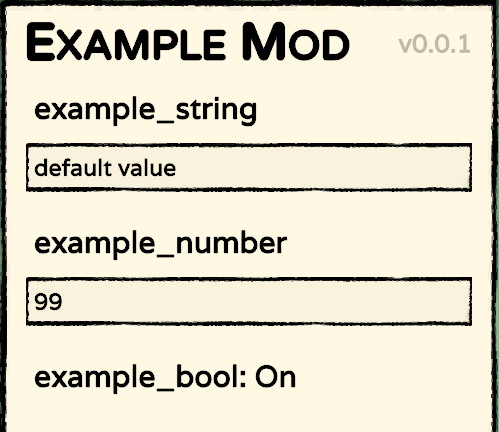
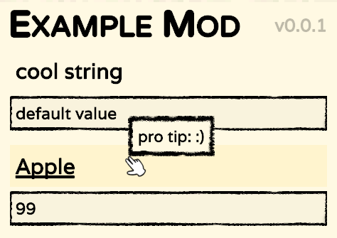

Using the Config system
#######################

Stacklands includes a config system that you can use to offer various options to players of your mod.
Each Mod has its own config file (``ConfigFile``), which you can access with ``Mod.Config`` (you don't
need to create your own!). The ``config.json`` file is stored in the mods folder.

Accessing a config entry
************************

Each ``ConfigFile`` stores any number of config entries. You can access an entry with the
``ConfigFile.GetEntry<T>()`` function. If an entry by that name doesn't exist yet, it will be automatically
created when accessing it. You can also specify a default value for the entry if it doesn't exist.

You can access or set the value of the entry with the ``Value`` and ``BoxedValue`` properties, depending on
the type you need.

.. highlight:: c#
.. code-block::
	:linenos:
	:caption: Example for creating config entries

	// in the mods Awake method, so Config is accessed as this.Config
	ConfigEntry<string> cstr = Config.GetEntry<string>("example_string", "default value");
	ConfigEntry<int> cint = Config.GetEntry<int>("example_number", 5);
	ConfigEntry<bool> cbool = Config.GetEntry<bool>("example_bool", true);

	Logger.Log($"cstr: {cstr.Value} | cint: {cint.Value} | cbool: {cbool.Value}");
	//> cstr: default value | cint: 5 | cbool: true
	cint.Value = 99;
	Logger.Log($"new cint: {cint.Value}");
	//> new cint: 99

The accessed config entries are added to the mods options menu, which can be accessed in
``Mod Options > <Mod Name>``, where the previous code will produce the following:

And the mods ``config.json`` will contain:

.. highlight:: json
.. code-block::
	:linenos:

	{
		"example_string": "default value",
		"example_number": 99,
		"example_bool": true
	}

Customizing the UI
******************

The Mod Options UI can be configured in 2 ways:

#. Using ``ConfigUI`` (``ConfigEntryBase.UI``) to customize the name and tooltip
#. Hiding the automatically created UI and constructing your own

Using ConfigUI
---------------

You can use the ``ConfigEntryBase.UI`` field to store any arbitrary data about the config entry. Some
keys are used by the default Mod Options screen, a list of which can be found below. Mod developers can use
the data to create customizable UI for types which are not supported in the base game, such as dropdowns for
enums or sliders for selecting number ranges.

The ``ConfigUI`` class (accessed as ``ConfigEntryBase.UI``) stores data about what to display in the mod options
menu for the config entry.

.. highlight:: c#
.. code-block::
	:linenos:
	:caption: Example use of ExtraData

	cstr.UI.Name = "cool string";
	cint.UI.NameTerm = "card_apple_name";
	cint.UI.Tooltip = "pro tip: :)";

The previous code will produce the following:

Using OnUI
----------

You can further customize the UI for a config entry with the ``ConfigUI.OnUI`` function, which is called when the
UI for the config entry is generated upon opening the Mod Options screen.

.. highlight:: c#
.. code-block::
	:linenos:
	:caption: Example use of ConfigEntry.OnUI

	cstr.UI.OnUI = (ConfigEntry entry) =>
	{
		Logger.Log("cstr UI is being generated..");
	};

When used alongside enabling the ``ConfigEntry<T>.UI.Hidden`` field, you can fully customize the UI.
The following example is taken from the `UnityExplorer mod <https://steamcommunity.com/sharedfiles/filedetails/?id=2966585489>`_,
its purpose is to call a function to open a custom options menu.

.. highlight:: c#
.. code-block::
	:linenos:

	var dummy = Config.GetEntry<bool>("dummy", true);
	dummy.UI.Name = "this should never appear"; // since it's hidden
	dummy.UI.Hidden = true;
	dummy.UI.OnUI = (ConfigEntryBase entry) =>
	{
		var btn = UnityEngine.Object.Instantiate(PrefabManager.instance.ButtonPrefab, ModOptionsScreen.instance.ButtonsParent);
		btn.transform.localScale = Vector3.one;
		btn.transform.localPosition = Vector3.zero;
		btn.transform.localRotation = Quaternion.identity;

		btn.TextMeshPro.text = "Open options";
		btn.TooltipText = "This will open the UnityExplorer options menu.";
		btn.Clicked += () =>
		{
			// UIManager is a UnityExplorer class, not a part of Stacklands
			UIManager.ShowMenu = true;
			UIManager.GetPanel(UIManager.Panels.Options).SetActive(true);
		};
	};