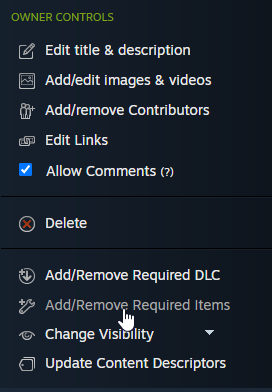

Dependencies
############

If your mod needs another mod to work, you should specify it as a dependency. You should
specify it in the ``manifest.json`` file and on the Steam Workshop.

``dependencies`` and ``optionalDependencies``
=============================================

In the ``manifest.json`` file you can specify a list of mod IDs as dependencies. If the
specified mod is installed and enabled, it will be loaded before your mod. If the mod is
not installed or enabled, your mod will not be loaded either.

.. code-block:: json
	:linenos:

	{
		"id": "example_mod",
		"name": "Example Mod",
		"dependencies": [
			"other_example_mod"
		],
		"optionalDependencies": [
			"another_example_mod"
		]
	}

In the above example, if ``other_example_mod`` is not installed or enabled, your mod will not be
loaded either. However, if ``another_example_mod`` is not installed or enabled, your mod will be
loaded regardless.

Adding the dependency on the Workshop
=====================================

On the Steam Workshop page of your mod, click "Add/Remove Required Items", and select the mods
yours depends on.

