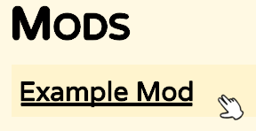
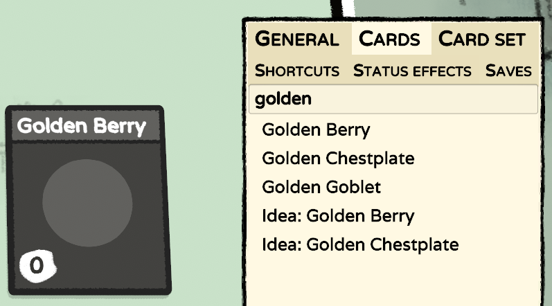
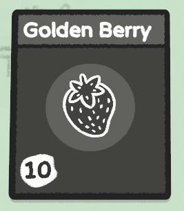
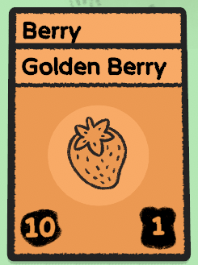
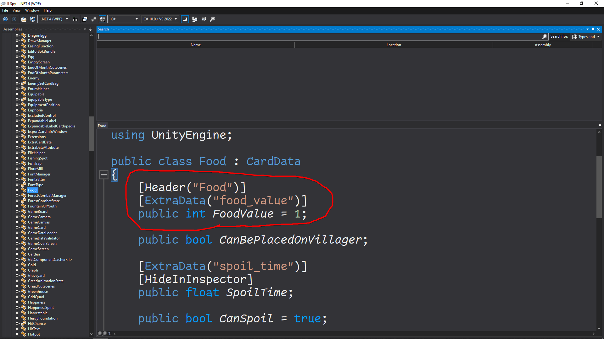
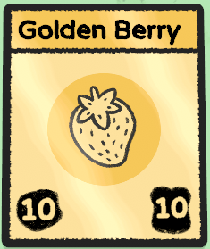
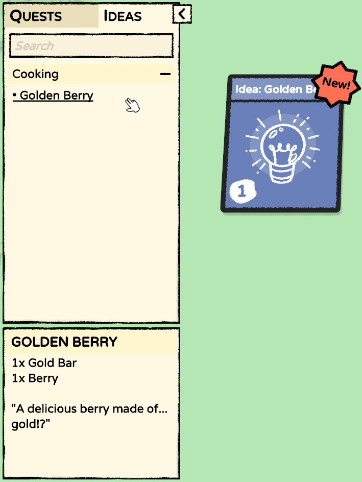
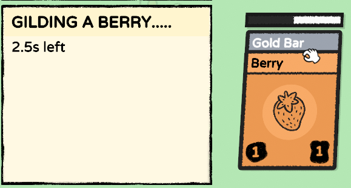

.. include:: ../global.rst

Guide 1: Golden Berry
#####################

This guide covers the basics of making a new card with a JSON file and localization. This guide assumes
that you've already read `The Tutorial <tutorial.html>`_.

Step 0. Downloading the files
=============================

* `localization.tsv <https://docs.google.com/spreadsheets/d/e/2PACX-1vRz14Suj2hTlJyyaTcCfImANxQ9kA8xOk4JuUOWDu0oIvDO0jJxvkQiEZmDeCFhE5_fmokzkW60Df5W/pub?gid=0&single=true&output=tsv>`_ - The full localization file for ALL three guides (make sure you download this file as ``localization.tsv``!)

Put the localization document in your mods folder (next to ``Mod.cs``).

Step 1. Creating the JSON file
==============================

All custom cards (and ideas and packs) are created with JSON files. Let's take a look at the bare minimum
need to create our first card! Create a ``golden_berry.json`` file in the ``Cards/`` folder, and add the following code:

.. code-block:: json
	:linenos:

	{
		"$schema": "../schemas/card.schema.json",
		"id": "examplemod_golden_berry",
		"nameTerm": "examplemod_golden_berry_name",
		"descriptionTerm": "examplemod_golden_berry_description"
	}

``$schema`` refers to a `JSON schema <schema.html>`_ file, which provides autocompletion features in some code editors.
``id`` is the cards ID. This must be a unique string, so it's highly recommended to prefix it with your mods ID!
``nameTerm`` and ``descriptionTerm`` are terms (see the `Localization <localization.html>`_ section for more info)
for the cards name and description respectively. You should use terms whenever possible, but you can choose to use
``nameOverride`` or ``descriptionOverride`` for quickly trying things out.

Step 2. Testing the mod
=======================

Let's run a quick test to make sure everything is working! Simply run the ``build.py`` script (ideally from a terminal),
and if everything went right, you should see a similar output:

.. code-block::

	built in 1.21s
	syncing folders..
	done!

If you set up everything correctly, you should now see your mod in game! You can verify it's loaded by checking the Mods menu:

If you can see the mod, that likely means your card is loaded too. While in a run, you can open the debug menu by holding the
K and O keys and pressing F1. Head to the "Cards" tab and search for the Golden Berry card, and click the text to spawn it!

.. note::
	If your card doesn't show up in the debug menu, there could be a few things going wrong:

	* If the mod is crossed out in the Mods menu, that means it's disabled. Enable it by clicking the "Disable/Enable Mods" button at the bottom of the Mods screen.
	* If the card name shows up as ``---MISSING---`` in the debug menu, the localization.tsv file didn't get copied correctly.

Step 3. Making the card useful
==============================

But first, let's make it look a bit nicer:

.. code-block:: json
	:linenos:

	{
		"$schema": "../schemas/card.schema.json",
		"id": "examplemod_golden_berry",
		"nameTerm": "examplemod_golden_berry_name",
		"descriptionTerm": "examplemod_golden_berry_description",
		"icon": "berry",
		"value": 10
	}

``icon`` is the cards icon. This may be a PNG file in the Images folder of your mod (such as "Example.png"), or the ID of a card.
If you provide a card ID, the icon will be "borrowed" from that card. ``value`` is the value of your card, you may set this to -1
if you want the card to be unsellable. Don't forget to build your mod after making changes to the JSON file!

Our golden berry now looks like a berry, and can be sold for 10 gold.

Now, we will turn it into a food that our villagers can consume. We can add functionality to our card with the ``script`` property,
where the value may be the name of any class that extends ``CardData``. In our case, this will be the ``Food`` class. We will also
need to set the ``type`` of our card to ``Food``.

.. code-block:: json
	:linenos:

	{
		"$schema": "../schemas/card.schema.json",
		"id": "examplemod_golden_berry",
		"nameTerm": "examplemod_golden_berry_name",
		"descriptionTerm": "examplemod_golden_berry_description",
		"icon": "berry",
		"value": 10,
		"type": "Food",
		"script": "Food"
	}

Our card now looks like any other food card (and can be stacked on them)! Villagers can also consume it, however it's only worth 1
food point. For further functionality, we will need to use :raw-html:`<u>Underscore Properties</u>`.

Underscore Properties are any key which starts with an underscore (_). The available properties depend on the selected script. All
public fields in the classes are available as underscore properties. If you `decompiled the game <decompiling.html>`_, you can easily
take a look at them. Let's take a look at the code of the ``Food`` class! We can find the ``Food`` class in ``GameScripts.dll``,
alongside all the base game code.

We can see a ``FoodValue`` field, and if we do some further digging into the code, we can figure out that this holds the food points
of a food card. If we want to set this value in a JSON file, we can simply prefix the field name with an underscore, like so:
``"_FoodValue": 10``. In the screenshot we can also see a ``CanSpoil`` field, so let's set that to false.

.. code-block:: json
	:linenos:

	{
		"$schema": "../schemas/card.schema.json",
		"id": "examplemod_golden_berry",
		"nameTerm": "examplemod_golden_berry_name",
		"descriptionTerm": "examplemod_golden_berry_description",
		"icon": "berry",
		"value": 10,
		"type": "Food",
		"script": "Food",
		"_CanSpoil": false,
		"_FoodValue": 10
	}

If we spawn a new Golden Berry card, we can see it has 10 food points and will no longer spoil on the island.

Step 4. Making the card pretty
==============================

We can also specify a custom color palette in the JSON to change how the card looks. These are done with the ``_HasUniquePalette`` and
``_MyPalette`` underscore properties.

.. code-block:: json
	:linenos:

	{
		"$schema": "../schemas/card.schema.json",
		"id": "examplemod_golden_berry",
		"nameTerm": "examplemod_golden_berry_name",
		"descriptionTerm": "examplemod_golden_berry_description",
		"icon": "berry",
		"value": 10,
		"type": "Food",
		"script": "Food",
		"_CanSpoil": false,
		"_FoodValue": 10,
		"_HasUniquePalette": true,
		"_MyPalette": {
			"Color": "#FFE299",
			"Color2": "#F8C74A",
			"Icon": "#000000"
		}
	}

The colors in ``_MyPalette`` are hex colors. We can also add ``"_IsShiny": true`` to make the card shiny like a coin. Our final card
will look like so:

Step 5. Creating the idea
=========================

If we want players to know how to make a Golden Berry, we need to tell them with an idea card. Idea cards are also created as JSON files
in the ``Blueprints/`` folder. Create a file called ``golden_berry_idea.json`` in the folder, and add the following code:

.. code-block:: json
	:linenos:

	{
		"$schema": "../schemas/blueprint.schema.json",
		"id": "examplemod_blueprint_golden_berry",
		"nameTerm": "examplemod_golden_berry_name",
		"group": "Cooking"
	}

Don't build your mod just yet, as this will cause errors! The blueprint needs to specify one or more :raw-html:`<u>subprints</u>`.
Subprints are what actually hold the "recipe" for a card. Many blueprints in the base game (such as Blueprint_Growth) hold dozens
of subprints.

.. code-block:: json
	:linenos:

	{
		"$schema": "../schemas/blueprint.schema.json",
		"id": "examplemod_blueprint_golden_berry",
		"nameTerm": "examplemod_golden_berry_name",
		"group": "Cooking",
		"subprints": [
			{
				"RequiredCards": "gold_bar, berry",
				"ResultCard": "examplemod_golden_berry",
				"Time": 5,
				"StatusTerm": "examplemod_idea_golden_berry_status"
			}
		]
	}

A subprint object needs to specify 4 things (at least): the required cards (seperated by a comma), a result card, the time it will
take (in seconds), and a text for the status. We can now spawn the idea card from the debug menu, and it will also show up in the
Ideas menu.

Step 6. Adding the idea to packs
================================

To make sure the idea card is available in card packs, we need to write a bit of code. In the ``Ready`` method of your ``Mod``
class, add the following line of code:

.. code-block:: c#
	:linenos:

	WorldManager.instance.GameDataLoader.AddCardToSetCardBag(SetCardBagType.CookingIdea, "examplemod_blueprint_golden_berry", 1);

This will add the blueprint to the CookingIdea set card bag (with a weight of 1, same as every other card in the bag), so it will
appear in the Curious Cuisine pack (as long as the idea hasn't been discovered yet).