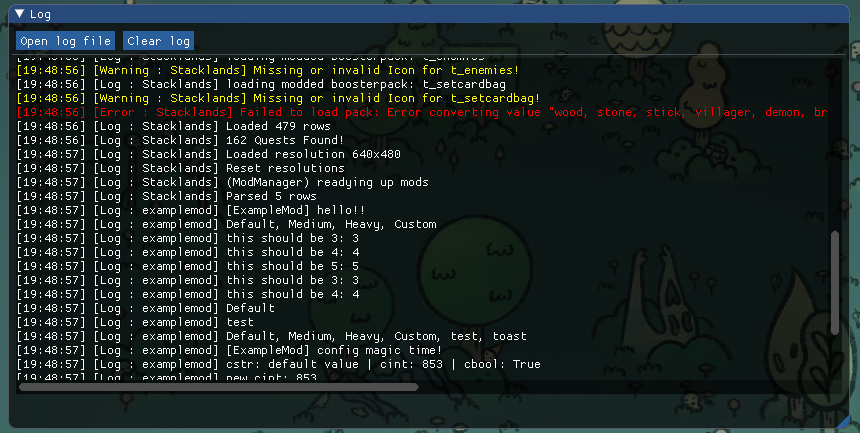
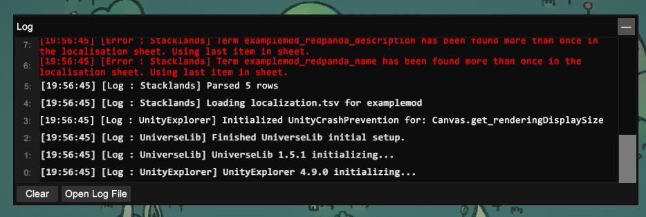

Viewing Logs
############

The log file [1]_ contains everything written by the ``Debug.Log`` (base game) and the ``Logger.Log``
(mods) functions. The log file can be viewed in the game in 2 different ways.

**Using the built-in log viewer**

The built-in log viewer can be opened at any time by pressing the ``F3`` key. The "Open log file" button
will open the log file in your default text editor, and the "Clear" button will clear only the log viewer,
not the log file.

**Using UnityExplorer**

`UnityExplorer <https://steamcommunity.com/sharedfiles/filedetails/?id=2966585489>`_ also includes a log viewer,
which can be toggled with the "Log" button in its menu. However, the UnityExplorer log may not contain all
logs that mods make. Similarly to the built-in one, it also has the "Open log file" and "Clear" buttons.

.. [1] Windows: ``%userprofile%\AppData\LocalLow\sokpop\Stacklands\Player.log`` | Mac: ``~/Library/Application Support/com.sokpop.Stacklands/Player.log``