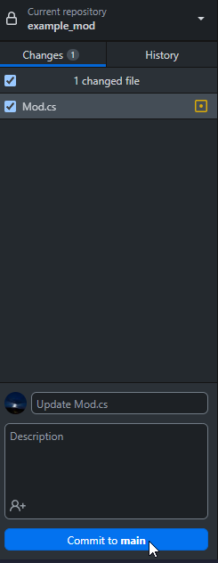
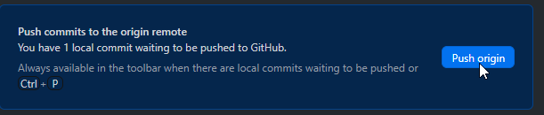
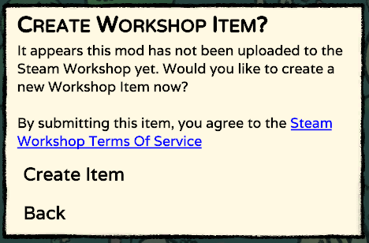
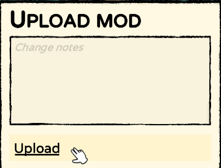
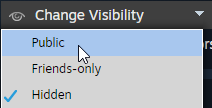
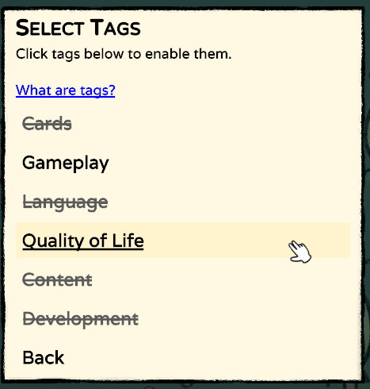
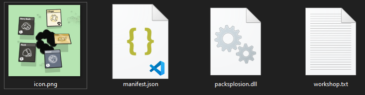

Publishing your mod
###################

Uploading your code to GitHub
=============================

It is highly recommended to upload your code to GitHub so other developers can contribute bugfixes
and anyone can easily make sure it doesn't contain anything malicious. If you used GitHub Desktop to
set up the mod template, this process is incredibly simple.

First, create a commit. Your changes will show up in the GitHub Desktop app. Click the "Commit" button
to create the commit.

Now you need to push the commit to GitHub, which the app will prompt you to do.

Your changes will now appear on your GitHub repository.

Uploading your mod to the Steam Workshop
========================================

To upload your mod to the Steam Workshop, go into your mods options menu, and click the "Upload Mod" button
to open the Workshop uploader menu.

.. note::
	This button only appears if you are the owner of the Workshop item, or the mod is in your local Mods
	folder. If you are a contributor or the button doesn't appear, you can always press the ``U`` key to
	open the uploader menu, however you may encounter permission errors when uploading.

For the initial upload, you will be prompted to create a Steam Workshop item.

After the item has been created, a ``workshop.txt`` file will be created in the mods folder. Be sure
to copy this to your source folder!

To upload the files, simply click the Upload button.

To finish publishing your mod, set the visibility to "Public" on the Workshop.

Adding tags
===========

Workshop tags let people easily find out what your mod is for. You can specify the tags in the uploader
menu by clicking the "Select Tags" button. You can enable tags by clicking the buttons. You can choose
as many tags as you want, but please only select the tags which apply to your mod. Below you can find a
table explaining when a tag should be used.

.. list-table::
	:header-rows: 1

	* - Tag
	  - Use if..

	* - Cards
	  - Your mod adds new cards to the game

	* - Gameplay
	  - Your mod adds new gameplay features or modifies existing ones

	* - Language
	  - Your mod adds support for a new language, or provides translations for other mods

	* - Quality of Life
	  - Your mod includes Quality of Life features

	* - Content
	  - Your mod adds new content to the game

	* - Development
	  - Your mod provides features that help other mod developers

Adding a thumbnail
==================

If you want your Workshop item to have a thumbnail, simply put an image called ``icon.png`` in your mods
folder. There are no requirements for the resolution, but 512x512 is recommended.

