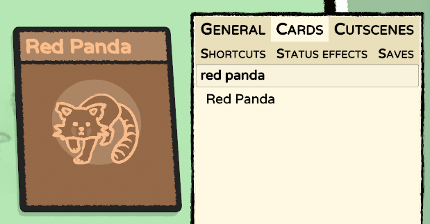
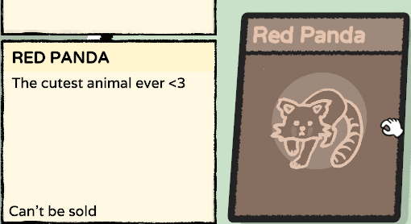
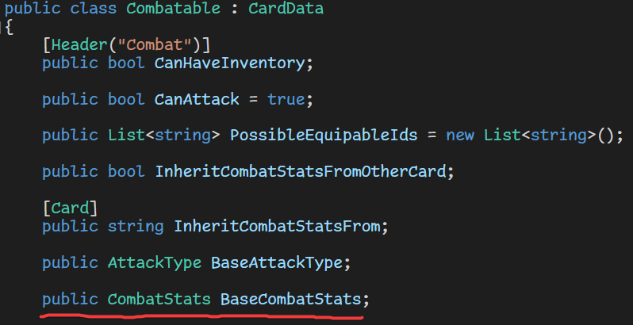
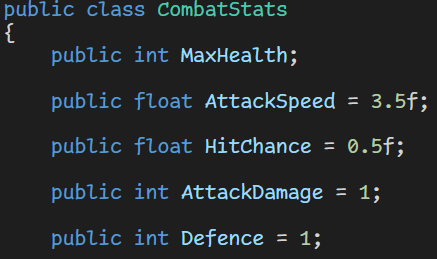
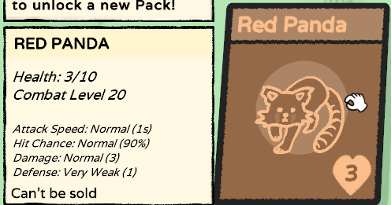

Guide 2: Red Panda
##################

This guide covers the basics of scripting and creating mobs. This guide assumes that you have
already followed `Guide 1: Golden Berry <golden_berry.html>`_.

Step 0. Downloading the files
=============================

* `localization.tsv <https://docs.google.com/spreadsheets/d/e/2PACX-1vRz14Suj2hTlJyyaTcCfImANxQ9kA8xOk4JuUOWDu0oIvDO0jJxvkQiEZmDeCFhE5_fmokzkW60Df5W/pub?gid=0&single=true&output=tsv>`_ - The full localization file for ALL three guides (make sure you download this file as ``localization.tsv``!)
* `RedPanda.png <https://cdn.discordapp.com/attachments/1000188860577349642/1112793577857220638/RedPanda2.png>`_ - Place this in the ``Icons`` folder of your mod. Icon drawn by `lopidav <discord://-/users/357116721812865025>`_

Step 1. Creating the card
=========================

Let's set up the very basics of the card first. Create a ``red_panda.json`` file in the
``Cards/`` folder, and add the following code:

.. code-block:: json
	:linenos:

	{
		"$schema": "../schemas/card.schema.json",
		"id": "examplemod_redpanda",
		"nameTerm": "examplemod_redpanda_name",
		"descriptionTerm": "examplemod_redpanda_description",
		"type": "Mobs",
		"icon": "RedPanda.png",
		"value": -1
	}

The card should now show up in the debug menu:

.. note::
	Possible mistakes:

	* If the card name or description shows up as ``---MISSING---``, you are missing the ``localization.tsv`` file, or it didn't get copied correctly
	* If the card doesn't have an image, make sure the file name in the ``Icons`` folder matches the value of the ``"icon"`` property in your JSON

Step 2. Turning it into an animal
=================================

Currently our red panda doesn't do anything, so let's fix that by adding a script to it.

.. code-block:: json
	:linenos:
	:lineno-start: 7

		"value": -1,
		"script": "Animal"
	}

If we take a look a `the code <decompiling.html>`_, we can see that the ``Combatable`` class
(which ``Animal`` inherits from) has a field for combat stats, which specifies things like
the max health, damage, attack speed, and more.

Let's implement it with an underscore property:

.. code-block::
	:linenos:

	{
		"$schema": "../schemas/card.schema.json",
		"id": "examplemod_redpanda",
		"nameTerm": "examplemod_redpanda_name",
		"descriptionTerm": "examplemod_redpanda_description",
		"type": "Mobs",
		"icon": "RedPanda.png",
		"value": -1,
		"script": "Animal",
		"_BaseCombatStats": {
			"MaxHealth": 10,
			"AttackDamage": 3,
			"AttackSpeed": 1,
			"Defence": 1,
			"HitChance": 0.9
		}
	}

Our red panda now has the specified stats:

Step 3. Scripting
=================

Let's give the red panda the ability to heal by feeding it with an apple. We are going to make
a new class in the ``Mod.cs`` file for this, inside the ``ExampleModNS`` namespace. All of the
explanations can be found in the comments.

If you are new to coding, you should read/watch a couple guides to learn the basics of C#. Such
a guide is not in the scope of this wiki, but here are some good ones:

* `Brackeys - How to Program in C# <https://www.youtube.com/playlist?list=PLPV2KyIb3jR4CtEelGPsmPzlvP7ISPYzR>`_
* `W3Schools - C# Tutorial <https://www.w3schools.com/cs/index.php>`_

Make sure the following code is inside the ``ExampleModNS`` namespace:

.. code-block:: c#
	:linenos:

	// create a class called RedPanda which extends the Animal class
	public class RedPanda : Animal
	{
		// this method decides whether a card should stack onto this one
		protected override bool CanHaveCard(CardData otherCard)
		{
			if (otherCard.Id == "apple")
				return true; // if the other card is an apple, we will let it stack
			return base.CanHaveCard(otherCard); // otherwise, we will let Animal.CanHaveCard decide
		}

		// this method is called every frame, it is the CardData equivalent of the Update method
		public override void UpdateCard()
		{
			// the ChildrenMatchingPredicate method will return all child cards (cards stacked on the current one) that match a given predicate function
			// the given function checks if the card is an apple, so the apples variable will be a list of the apple cards on the red panda
			var apples = ChildrenMatchingPredicate(childCard => childCard.Id == "apple");
			if (apples.Count > 0) // if there are any apples on the red panda
			{
				int healed = 0; // create a variable to keep track of how much health the red panda gained
				foreach (CardData apple in apples) // for each apple on the red panda
				{
					apple.MyGameCard.DestroyCard(); // destroy the apple card
					HealthPoints += 2; // increase the red pandas health by 2
					healed += 2; // keep track of how much it healed in total
				}
				AudioManager.me.PlaySound(AudioManager.me.Eat, Position); // play the eating sound at the red pandas position
				WorldManager.instance.CreateSmoke(Position); // create smoke particles at the red pandas position
				CreateHitText($"+{healed}", PrefabManager.instance.HealHitText); // create a heal text that displays how much it healed in total
			}
			base.UpdateCard(); // call the Animal.UpdateCard method
		}
	}

To make the red panda use this script, change the ``"script"`` in the JSON to ``ExampleModNS.RedPanda``.

.. code-block::
	:linenos:
	:lineno-start: 8

	"script": "ExampleModNS.RedPanda",

If you build your mod now, the red panda should have all the functionality of the script.

.. image:: images/red_panda_6.gif