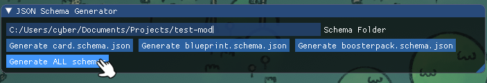
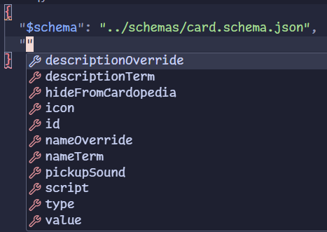
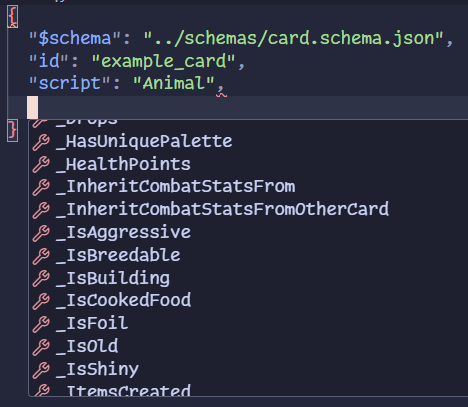

JSON Schemas
############

JSON Schemas make it much easier to work with JSON files when creating custom cards, blueprints,
or packs. They provide powerful context-aware autocompletion for Underscore Properties. Schemas
of the latest vanilla game version are included in the `mod template <https://github.com/stacklandsdev/mod-template>`_.

.. note::
	Schemas are an optional feature to help with developing custom cards, they are not a requirement
	in any way, and they are not used for validation purposes.

Generating Schemas
==================

To generate the JSON Schemas, press ``F6`` in-game to open the Schema Generator menu. Provide a path
to the folder where you want the schemas to be generated. This is recommended to be somewhere in
your source folder.

Using Schemas
=============

To use a schema in your JSON file, add a ``$schema`` property, with the key being a path to the schema
file. If the path is correct, you should start seeing suggestions for the properties.

After specifying a ``"script"``, suggestions will also be offered for Underscore Properties

.. image:: images/schema_4.png

.. note::
	Schemas also support your custom classes, but you will need to regenerate the schemas while
	your mod is loaded!

Customizing Schemas
===================

Schema generation is done by the ``SchemaGenerator`` class. If you're interested in customizing certain
aspects of it, take a look at the following fields and methods in the class: ``PropBlacklist``, ``PropOverride``,
``TypeLookup``, ``FieldToJson``.