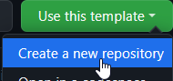
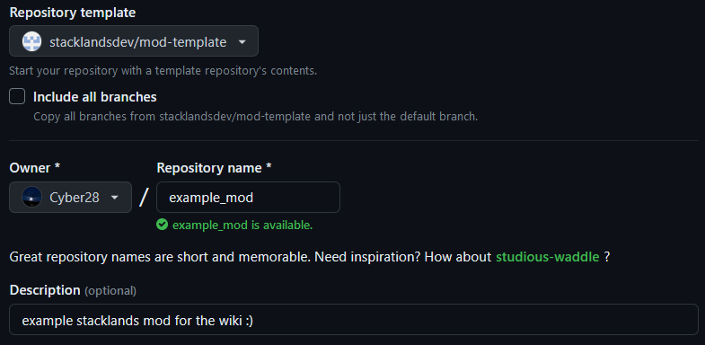
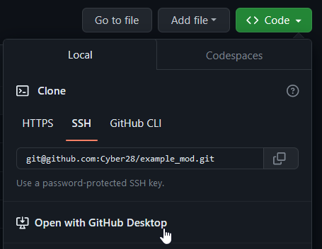
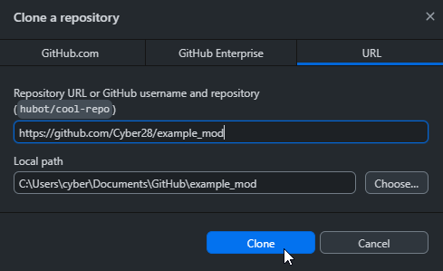

Guide 0: The Tutorial
#####################

Welcome to the section of the wiki simply titled "The Tutorial". This page will guide you through
setting up the mod template, and creating a few of your own cards!

Step 0. Requirements
====================

* Stacklands
* `.NET SDK 7.0 <https://dotnet.microsoft.com/en-us/download>`_
* `Python <https://www.python.org/downloads/>`_ (not necessary, but lets you use a helpful build script)
* A bit of programming experience, or the desire to learn

If you don't have a favorite one already, you wil also need to pick a code editor. While you can technically
write your mods in notepad, code editors come with many benefits such as autocompletion, syntax highlighting,
powerful extensions, and everything else you could ask for when making mods. Here are some recommended code
editors:

.. list-table:: Recommended code editors
    :header-rows: 1

    * - Code editor
      - Description

    * - `Visual Studio Code <https://code.visualstudio.com>`_ + `C# extension <https://marketplace.visualstudio.com/items?itemName=ms-dotnettools.csharp>`_
      - Visual Studio Code is a very lightweight code editor, perfect for weaker hardware and quick development. It is fully free and open-source, and has amazing extension support.

    * - `Visual Studio 2022 <https://visualstudio.microsoft.com/vs/>`_
      - Visual Studio 2022 is a heavier `IDE <https://en.wikipedia.org/wiki/Integrated_development_environment>`_ with excellent tools for C# development, and hundreds of great features that bigger mods will definitely find useful.

    * - `Rider <https://www.jetbrains.com/rider/>`_
      - Rider is a paid IDE that more advanced developers will find many reasons to appreciate, and it will be familiar to people who have used IntelliJ IDEA or PyCharm before.

(Optional) Step 0.1. Decompiling the game
=========================================

`Decompiling the game <decompiling.html>`_ is the best way to learn about how certain features are implemented,
and is a highly recommended step for any developer.

Step 1. Setting up the template
===============================

The easiest way to set up the mod template is by using `GitHub Desktop <https://desktop.github.com/>`_. After
downloading it and signing in with your account, Open the `Mod Template page <https://github.com/stacklandsdev/mod-template>`_
and click the "Use this template" button. After that, configure some basic data about the new repository.

After your repository has been created, open it with GitHub Desktop, and choose a folder where the files will be
downloaded.

You can now open the files in your favorite code editor, and configure the following things:

#. In ``Mod.csproj.user``, set ``<stacklands>`` to the directory where you installed Stacklands.
#. In ``manifest.json``, configure your mods name and ID. Make sure the ID doesn't include any spaces or other special characters!
#. In ``Mod.csproj``, set ``<AssemblyName>`` to your mods ID. By default this is "ExampleMod".
#. In ``Mod.cs``, change ``ExampleMod`` to your mods ID, and ``ExampleModNS`` to your mods ID followed by "NS". This is used to differentiate between your mod and others.

The guides in this wiki will use the default values, such as "ExampleMod".

Step 2. Pick a guide
====================

This wiki features 3 more tutorials that fully guide you through making new content:

* `Golden Berry <golden_berry.html>`_ - Covers the basics of making a new card (and the idea for it) with a JSON file and localization
* `Red Panda <red_panda.html>`_ - Covers the basics of scripting and creating mobs
* TBD - Advanced guide, covers creating new equipment and a new villager type
